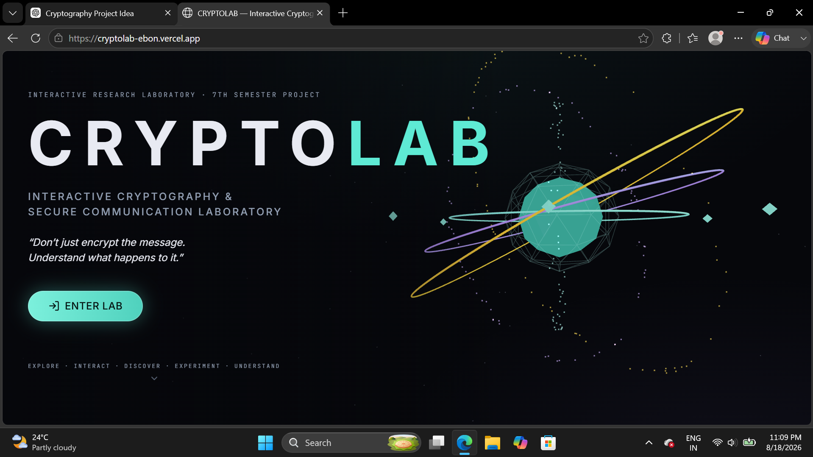
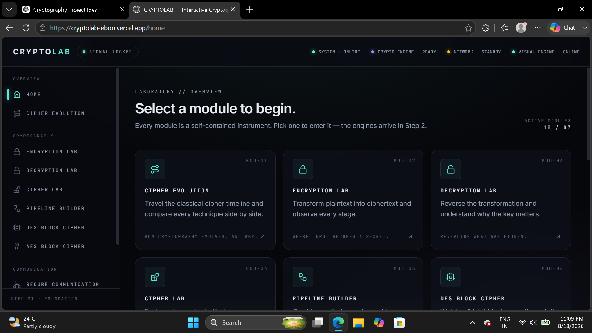
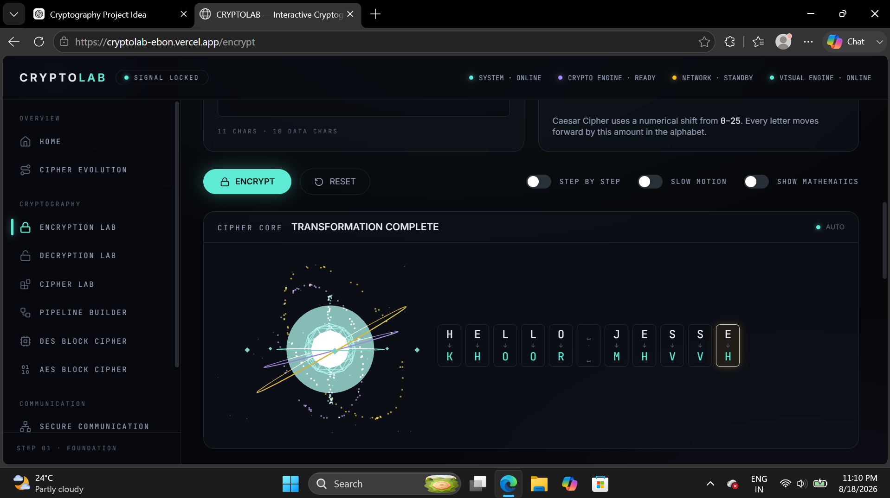
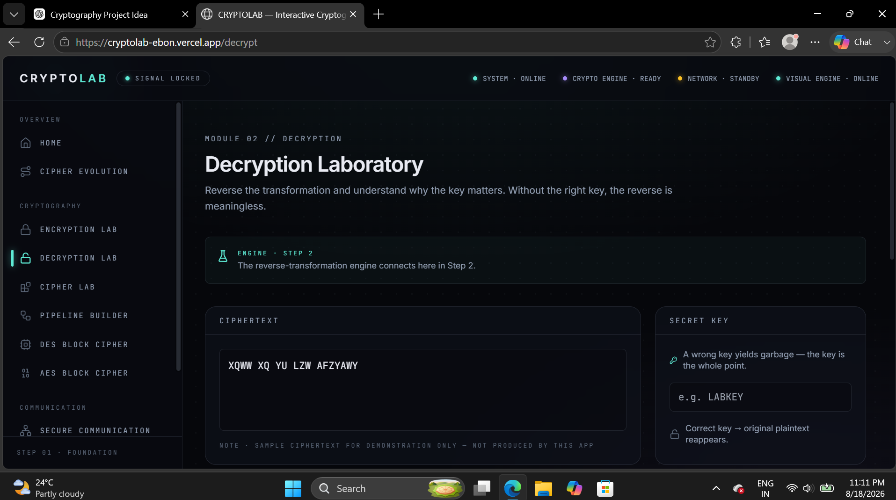

# CRYPTOLAB

Interactive Cryptography & Secure Communication Laboratory

> Don't just encrypt the message. Understand what happens to it.

## 🚀 Live Demo

[Open CRYPTOLAB](https://cryptolab-ebon.vercel.app/)

## 📚 Features

- Caesar Cipher
- Vigenère Cipher
- Hill Cipher
- DES
- AES-128
- Encryption & Decryption Labs
- Secure Communication Simulation
- Cryptographic Attack Lab
- Learning Center

## 🛠️ Technologies

- React
- TypeScript
- Vite
- Tailwind CSS

## 🖥️ Project Preview

### CRYPTOLAB Landing Page

### Laboratory Dashboard

### Encryption Laboratory

### Decryption Laboratory

VTU 7th Semester — Cryptography and Network Security

## 👨‍💻 Creator

Jesse Silvanus
